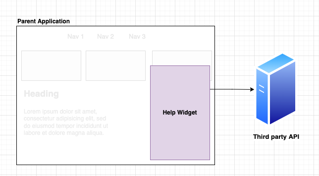
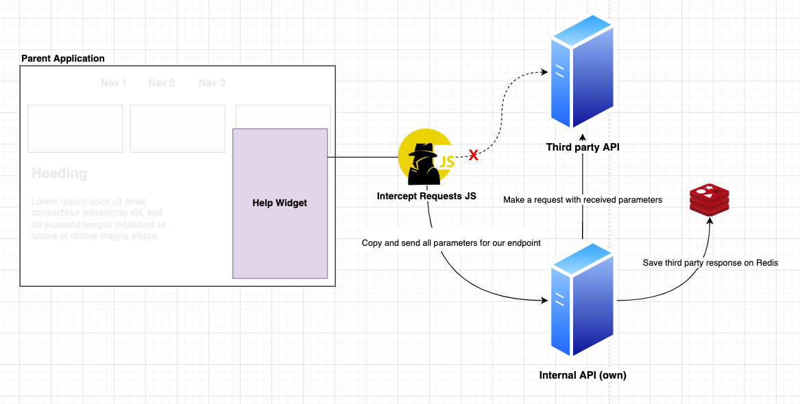

<p align="center">
  
</p>
<h1 align="center">
    Intercept Requests JS
</h1>

<h4 align="center">
    ☕ Code and coffee
</h4>
<p align="center">
  

  
  
  <a href="https://github.com/luispmoraisc/intercept_requests_js/commits/master">
    
  </a>

  <a href="https://github.com/luispmoraisc/intercept_requests_js/issues">
    
  </a>

  
</p>

## Project

The project `intercept-requests-js` was born because of the necessity to redirect specific requests of third party
scripts for another endpoint.

Sometimes we need to use third party tools inside our applications to improve user experience or to provide help
widgets. But, most of the time we need to create an integration with those tools and we can't control what those scripts
are using from the external world, such as HTTP requests etc.

With intercept-requests-js you can intercept specific requests by domain, by keyword and in a near future with regex.
When you intercept a http request, you can redirect it, change headers, change body, or anything else that you want
before your browser sends it.

## How to use

### Install

Install intercept-requests-js with npm:

```sh
$ npm i --save intercept-requests-js
```

Or using yarn:

```sh
$ yarn add intercept-requests-js
```

### Configuration

This module will provide an `InterceptRequestsJs` function and `ListItem` that is the type of configuration item. You
just need to create your `Array<ListItem>` and pass it to the InterceptRequestsJs function like this.

```ts
import { InterceptRequestsJs, ListItem } from 'intercept-requests-js';

const listItems: ListItem[] = [
  {
    listening: 'yahoo',
    ignore: [],
    executeWhenOpen: (context: XMLHttpRequest, args: (string | boolean)[]) => {
      return { objectRequest: context, newArguments: args };
    },
    executeBeforeSend: (context: XMLHttpRequest, args: (string | boolean)[]) => {
      return { objectRequest: context, newArguments: args };
    },
  },
];

InterceptRequestsJs(listItems);
```

Now, when any request matches with any listening property of `Array<ListItem>`, the methods `executeWhenOpen` and
`executeBeforeSend` will be called before browser dispatches it, so if you need to change something on an intercepted
request, do it in your methods. For example, let's suppose that one widget/script is using some yahoo service and I want
to redirect this search for google, I can do it like this:

```ts
// Intercept all requests that contain yahoo in your domain and redirect to google:
import { InterceptRequestsJS, ListItem } from 'intercept-requests-js';

const executeWhenOpen = (context: XMLHttpRequest, args: (string | boolean)[]) => {
  const newArguments = ['GET', 'http://google.com', args[2]];

  return { objectRequest: context, newArguments };
};

const listItems: ListItem[] = [
  {
    listening: 'yahoo',
    ignore: [],
    executeWhenOpen: (context: XMLHttpRequest, args: (string | boolean)[]) => executeWhenOpen,
  },
];
InterceptRequestsJs(listItems);
```

Obviously it isn't the best example, we can't change the contract of return that script is waiting, because it can break
the application and we don't want this to happen. But, let me show you a real example:

## Real usecase

Before start, for reasons of ethic I'll call the name of third party product as `help widget`.

At one of my last jobs, we were using `help widget` to share articles with our users, and although `help widget` is an
awesome product we had some problems with latency, down API etc., and it impacted our users and our attendance teams.
So, we didn’t have time and it didn't make sense at that moment to build our own widget. We decided to create a
microservice that receives the `help widget` requests and keep in cache the responses to guarantee that the content will
be shown for our users. Basically, we create one layer inside our infrastructure to receive `help widget` requests, send
this request to `help widget` API from our back end and save in cache the response. It has been about 3 years that this
product is running without any problems and gets around 28 million views every month.

Without Intercept Requests JS



With Intercept Requests JS



### Types

```ts
export declare type ItemConfig = {
  listening: string;
  ignore: Array<string>;
  executeWhenOpen: (
    context: XMLHttpRequest,
    args: (string | boolean)[]
  ) => {
    objectRequest: XMLHttpRequest;
    newArguments: (string | boolean)[];
  };
  executeBeforeSend?:
    | ((
        context: XMLHttpRequest,
        args: (string | null)[]
      ) => {
        objectRequest: XMLHttpRequest;
        newArguments: (string | null)[];
      })
    | undefined;
};
```

### Caution!

The methods `executeWhenOpen` and `executeBeforeSend` receive `args` parameter and the values needs to follow this sequency:

`executeWhenOpen`: ['http method', 'URL']
For more information see the page of [XMLHttpRequest.open](https://developer.mozilla.org/pt-BR/docs/Web/API/XMLHttpRequest/open)

`executeBeforeSend`: ['body']
For more information see the page of [XMLHttpRequest.send](https://developer.mozilla.org/pt-BR/docs/Web/API/XMLHttpRequest/send)

## Next steps

- Enable Regex.
- Provide a method to change API response value.
- Create example codes

## How to contribute

- Make a fork bases in this repository
- Create a new branch `git checkout -b my-feature`
- Commit your changes `yarn commit`
- Push your changes `git push origin my-feature`

After the merge of your pull request is done, you can delete your branch

## 📝 License

This project is based on the MIT License. See the file [LICENSE](LICENSE) for more informations.
